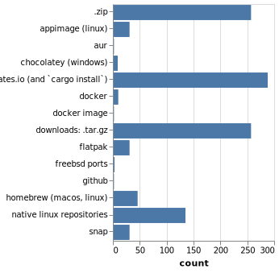

# Rust CLI 调研

在 2018 年 3 月，我们一直在接受对 Rust CLI 调研的回复。这项调研旨在，根据社区给予[CLI 工作组](https://github.com/rust-lang-nursery/cli-wg)（CLI-WG）的意见，为我们提供一些重点目标。

Rust 2018 的目标之一是，让 Rust 的命令行应用程序尽可能无摩擦（并且有趣！）。我们非常兴奋地说：我们收到了 1,045 条回复！结果虽然多种多样，却为实际目标，描绘了一幅非常清晰的画面。

由于 CLI-WG 相对较小，遗憾的是我们无法解决本调研中提出的所有问题。但对于我们的教程所展示的，我们希望升华社区共同的内容，以及您可以在自己的箱子和项目中，使用上的内容认识。

在任何官方评审，或给予 CLI-工作组 任何帮助时，我们也将使用这些结果来指导我们的解决方案。

在我们深入研究结果之前，让我们首先定义一个 CLI，[要依据工作组](https://github.com/rust-lang-nursery/cli-wg/issues/4)，这是为了适当限制范围。

> 对于我们的意图和目的，CLI 是任何程序
>
> - 在终端发射
> - 接受来自各种源的配置，例如命令行参数，环境变量或配置文件
> - 使用最少/无用户交互，即可完成运行
> - 接受来自`stdin`，文件或网络的输入
> - 对某些输入（文件，网络，`stdin`），可基于某指定配置
> - 通过标准输出（文件，网络，`std{out,err}`）交互
>
> （我们[特别指出][i4]，现在并不想专注于“TUI”应用程序。）

[i4]: https://github.com/rust-lang-nursery/cli-wg/issues/4

这可能不是一个包罗万象的定义，但我们也只是暂用，用来限制范围。一些（甚至很多）调研受访者，对 TUI 做了评论（即，提供交互式命令行界面的程序，如`vim`要么`top`），所以我们想说我们承认这个差距，并且可能会在未来寻求协助。但是目前我们会说，这对这个工作组来说“超出范围”（范围/步子太大，我们可能永远无法完成任何事情！）。

有了这个，让我们来看看一些回复，以及我们对结果做了些什么。

## 回复

从人口统计数据开始，令人惊讶的是（并且非常感激）大约 44％的受访者使用 Rust 不到一年，或者根本没有使用 Rust！这很棒，因为它让我们“新的眼睛”，去审视 Rustaceans 可能长时间掩饰掉的，却因他们很久以前就已经解决它（或者找到了解决方法）的问题。然而，这些问题不仅损害了采纳(方案)，而且造成了不必要的摩擦。

同样，大约 33％的受访者表示，他们从未或当前没有在 Rust 中编写 CLI 应用程序。我们就可以使用这些信息，来查看任何相关的摩擦点，这些摩擦，可能会阻档那些可能没有花太多时间挖掘箱子/文档等的人。

### 正在使用的箱子

在回复中已经写过（或正在编写）Rust 应用程序（大约 588 个回复）的 CLI 应用程序的人中，我们询问了他们正在使用的当前箱子。这给了，我们一个很好的常用库列表，或者我们可以专注于打磨 API 和改进整体文档和指南。此列表还显示了一些不怎么了解的箱子，其*欧米茄级*的潜力。我们不会在这里列出所有的箱子，因为列表很长，但它将极大地帮助 CLI-WG ，确定在哪里集中精力。

词之云最终看起来像这样（链接包含更高分辨率的图像）：

### 在哪里改进

之后，我们问这些箱子在哪些方面可以得到最大的改进。响亮的答案（并在整个调研中重复）是更全面的文档、教程和指南/示例。对更好的文档和示例的请求，占了回答这个问题的一半以上，分别占 45%和 57%！

在整个调研过程中，很多时候都有人要求，做一件事的能力，而事实上，已经有一个很好的箱子可以用来行驶这件事了。有许多回复，请求特定的命名箱子的某些功能，但有时功能已经存在于所述箱子了。

这再次在我们脑海中强调，对更好的文档和示例的需求。由于这些回复，我们计划重新查看自己箱子的文档和示例。

在我们的 cli-wg 存储库中，有一个“跟踪问题”列表，用于讨论与工作组相关的解决方案和问题。由于这项调研，我们提出了更多的 issue(页面)，来解决人们提出的担忧。

对于第一部分，我们打开了两个问题(issue)：

- [The "ideal guide" for writing CLI apps in Rust · Issue #6 · rust-lang-nursery/cli-wg · GitHub](https://github.com/rust-lang-nursery/cli-wg/issues/6)）
- [Improve ecosystem discoverability · Issue #11 · rust-lang-nursery/cli-wg · GitHub](https://github.com/rust-lang-nursery/cli-wg/issues/11)

> 译者：因 issue 讨论页面，基本都是英文，顾不翻译(下面的同样如此)。

在贡献或维护箱子时，示例和文档也将是重点关注领域。

平台可用性排在第二位（约占 14%），因此我们决定在讨论，和创建任何官方解决方案，或来自 cli-wg 的评论时，(主要)考虑三大平台（Linux、Windows 和 MacOS）。

### 现有差距

接着，我们问：在处理 cli 应用程序时，当前生态系统中的差是什么，以及被调研者对它们做了什么。结果可以总结为以下要点（不一定按顺序排列）：

- CLI 应用程序结构，更好的指南/示例
- （跨平台）配置文件管理
  - 更好的工程学，可以合并不同级别的配置（全局、项目、CLI 标志）
- 更好的文件路径工程学
- 发布/打包指南/示例
  - 更多关于二进制发布的文档/工具
- 干净的 readline 实现，每个当前产品的问题
- 标准化生成/安装手册页
- 更好的 CLI 测试
- 终端着色（尤其是，Windows）
- 更好的日志记录（或降低当前的复杂性）
- 更好的箱子文档
- 更多 lib 到 1.0 版本
- 改进错误处理
- 发现箱子的能力

原始，词之云如下所示（链接包含更高分辨率的图像）：

请注意，词之云包含了现有差距、受访者所做的工作等，但它仍然能为 _如今_ Rust 生态系统发生的事情，描绘一幅准确的图像。

为了开始解决其中一些问题，我们打开了以下问题：

- [Config file management · Issue #7 · rust-lang-nursery/cli-wg · GitHub](https://github.com/rust-lang-nursery/cli-wg/issues/7)
- [Testing CLI apps · Issue #9 · rust-lang-nursery/cli-wg · GitHub](https://github.com/rust-lang-nursery/cli-wg/issues/9)
- [Cross-platform file system abstractions · Issue #10 · rust-lang-nursery/cli-wg · GitHub](https://github.com/rust-lang-nursery/cli-wg/issues/10)
- [Embrace Standardized Color Control · Issue #15 · rust-lang-nursery/cli-wg · GitHub](https://github.com/rust-lang-nursery/cli-wg/issues/15)
- [Documenting CLIs · Issue #23 · rust-lang-nursery/cli-wg · GitHub](https://github.com/rust-lang-nursery/cli-wg/issues/23)
- [Error handling in CLI apps · Issue #12 · rust-lang-nursery/cli-wg · GitHub](https://github.com/rust-lang-nursery/cli-wg/issues/12)
- [Improve ecosystem discoverability · Issue #11 · rust-lang-nursery/cli-wg · GitHub](https://github.com/rust-lang-nursery/cli-wg/issues/11)

这似乎也是一个普通的主题，人们只是想知道，“在开始做`X`时，我[至少][at least start with]应该用什么箱子”，有时，有许多目标相似的箱子似乎在竞争。虽然我不相信 Rust 小组会去“祝福”某些个箱子，因为这会让，萌新很难任意选择，但实际上，最好“推翻”任何当前广泛使用的箱子，但我们*可以*做的更好，就是让事情清晰可见，哪些箱子得到积极维护和广泛使用。这与 cli-wg 的目标有些正相交，因为它与 crates.io 团队最近所做的工作交叉了，但这仍然是我们想要考虑的事情，和朝着所有的目标努力。

从 cli-wg 的角度来看，这其中的一个关键部分是，更多如何执行任务的指南/教程，并且使用证明过的第三方箱子编写 cli，自然会提高对那些箱子，至少已经有过“战斗测试”的认识。

## 构建后

我们想知道人们在构建了 CLI 应用程序之后会做什么。他们的目标是什么平台，他们如何发布，等等。这些反应，帮助我们确定哪些领域将是未来的重点。

### 平台目标

首先，我们问人们瞄准哪些平台，结果是这样的：

- Linux（92% - 662 responses）
- MACOS（53% - 365 responses）
- Windows（40% - 278 responses）
- BSD Variants（12% - 85 responses）
- Embedded（7% - 47 responses）

不会有太多意外，但仍然是一个有用信息，因为它显示的只是人们经常瞄准 Windows 的应用。我个人只是把 Widnows 当作第二类公民来处理，而在这次调研之后，我的个人目标是改善我的 Widnows 支持！

### 平台的特定问题

我们问，是否有任何平台的特定问题（一些我们已经意识到的问题），并再次明确结果！Windows 支持在生态中是天然缺失的，其中包括，终端颜色支持，路径处理，配置文件处理等。下面是常问主题的总列表

- Windows 支持！！
  - 染色
  - 路径
  - 配置
- 展示平台的特色，需要更多的箱子
- 跨平台计算仍然是复杂的
- `OsStr`/`OsString`
  - `&str`/`String`比较的不一致
  - 工程学的使用
  - 一般的混乱
- 如何指定特定平台的 deps 吗
- 缺乏良好的信号处理箱

这有些，之前是 CLI-WG 一直在积极工作，比如[@BurntSushi's](https://github.com/BurntSushi)优秀的[`termcolor`](https://crates.io/crates/termcolor)箱子，是专门设计的跨平台
终端颜色支持。但我们其实又回到了上面所说的，发现-能力的问题

协助上面的'炮火'，我们已经打开了

- [Embrace Standardized Color Control · Issue #15 · rust-lang-nursery/cli-wg · GitHub](https://github.com/rust-lang-nursery/cli-wg/issues/15)
- [Improve ecosystem discoverability · Issue #11 · rust-lang-nursery/cli-wg · GitHub](https://github.com/rust-lang-nursery/cli-wg/issues/11)
- [Ergonomics of Cross Compiling · Issue #25 · rust-lang-nursery/cli-wg · GitHub](https://github.com/rust-lang-nursery/cli-wg/issues/25)
- [Ergonomics of String handling · Issue #26 · rust-lang-nursery/cli-wg · GitHub](https://github.com/rust-lang-nursery/cli-wg/issues/26)
- [Cross-platform file system abstractions · Issue #10 · rust-lang-nursery/cli-wg · GitHub](https://github.com/rust-lang-nursery/cli-wg/issues/10)
- - [Signal handling · Issue #27 · rust-lang-nursery/cli-wg · GitHub](https://github.com/rust-lang-nursery/cli-wg/issues/27)

### 分发

最后，我们想知道人们如何让他们的 CLI 应用走向世界。现在，有两大方法，一是 crates.io ；二是`cargo install`的普通压缩(或`tar.gz`的)二进制文件。

这为我们指出，一个专注的重点，因为`cargo install`最初不是设计来处理终端用户大规模的分发。(查看[我的这个 issue 讨论](https://github.com/rust-lang-nursery/cli-wg/issues/8#issuecomment-370565293))。老实说，我们不会要求人们区分，什么是“Rust 开发者”的应用，什么是“通用功能”的应用。（`cargo install`的设计 _绝对_ 是为了简单分发，在 Rust 开发中使用的工具。）所以，我们正在努力减少使用其他更合适的分发方法时的摩擦，同时增加在 Rust 开发中，`cargo install`的使用经验。

我们为打包和分发，给出了以下问题位置：

- [Packaging and distributing apps · Issue #8 · rust-lang-nursery/cli-wg · GitHub](https://github.com/rust-lang-nursery/cli-wg/issues/8)
- [Improving binary distribution through cargo. · Issue #20 · rust-lang-nursery/cli-wg · GitHub](https://github.com/rust-lang-nursery/cli-wg/issues/20)
- [Support development of well-behaved CLI apps · Issue #21 · rust-lang-nursery/cli-wg · GitHub](https://github.com/rust-lang-nursery/cli-wg/issues/21)

选择更多其他的分发方法的完整列表，(大约的回复率)：

- crates.io / `cargo install` (58% - 288 responses)
- Zipped binary (51% - 257 responses)
- Native Linux Repos (27% - 135 responses)
- Homebrew (9% - 46 responses)
- Linux snap/flatpak/AppImage (6% - 31 responses)
- Docker (2% - 10 responses)
- Windows Chocolatey (2% - 9 responses)

## 与其他语言相比

我们问使用 Rust 的人，为什么选择它作为他们的 CLI 应用。结果让我们很开心，因为大多数人说他们真的很喜欢 Rust！我们都同意这个不可动摇的理由。第二原因是 Cargo 和生态，还有它的性能。

有趣的是，并不是很多人会说，它的文档，安全性或静态二进制，而这些是 Rust 的卖点——我们认为会有部分原因。因为这些(特性)在编程语言间是竞争点，但(因为)我们能在这些方面做得更好的。（‘在哪里改进'小节也有提及）

我们也询问受访者之前是否有写过其他语言的命令行经验，还有哪些是 Rust 可以学习的。

Python 的远远领先。前几个语言：

- Python 56% (516 回复)
- C/C++ 26% (237 回复)
- Go 14% (128 回复)
- Ruby 13% (116 回复)
- Bash 11% (100 回复)

还有许多其他的语言，但比例下降的很快。下面是词之云（链接包含很清晰的图片）：

### 我们能学到什么?

拥有上面的数字，我们还问了问，哪些语言比 Rust*更好的*，和我们可以向他们学习什么。

绝大多数似乎有两个共同的主题：

- 快速原型/发展速度(来自 Python/Ruby)
- 更全面的“框架”(来自 Ruby，还有些来自 Python)

尽管，使用静态的，类型化编译语言天然在快速原型和开发速度上，会有一些减弱，毕竟不像 Python 或 Ruby 语言，但这仍然是一个我们关心的问题。我们想要 Rust 的小脚本能够如同在 Python 或 Ruby 一样简单（或至少，这是我们努力的目标）。

开发速度的另一个方面，就是提升生态周围的小物件，比如 Strings 和 文件路径。这给我带来了另一个不那么频繁，但仍然重要的主题是

- 更多的例子
- 发布上，更多的指导/工具
- 编译时间
- 更好的，符合人体工程学的字符串处理

为了解决上面的，我们打开了:

- [Ergonomics of String handling · Issue #26 · rust-lang-nursery/cli-wg · GitHub](https://github.com/rust-lang-nursery/cli-wg/issues/26)
- [Cross-platform file system abstractions · Issue #10 · rust-lang-nursery/cli-wg · GitHub](https://github.com/rust-lang-nursery/cli-wg/issues/10)
- [Packaging and distributing apps · Issue #8 · rust-lang-nursery/cli-wg · GitHub](https://github.com/rust-lang-nursery/cli-wg/issues/8)
- [The "ideal guide" for writing CLI apps in Rust · Issue #6 · rust-lang-nursery/cli-wg · GitHub](https://github.com/rust-lang-nursery/cli-wg/issues/6)

其他的子弹是众所周知的，比如编译时间，且其他团队也在积极工作

_说句题外话, 许多受访者说，Rust 与其他语言相比，已经在 CLI 世界做了 great 的事情。 (♥)._

## 还有别的事吗?

作为一个分开的问题，我们问受访者是否还有什么要对我们说的话。再次，出现一些常见主题。多数已在上面的总结列表中，但也提到了几点关键点：

- `const fn` / `constexpr` 拜托!
- `impl Trait`拜托!
- `cargo`的构建步骤文章是必要的
- 1.0 箱子需要更多的努力
- 需要自动生成手册

正如上面提到的，[`miri` 最新与 `rustc` 合并了](https://github.com/rust-lang/rust/pull/46882)，这是重大进展`constfn` / `constexpr`!还有，[`impl Trait` 最近 `r+`的了](https://github.com/rust-lang/rust/pull/49255#issuecomment-375368749)！这都快两分了！

一些解决上面的问题位置是:

- [Tracker of Issues in Other Crates · Issue #14 · rust-lang-nursery/cli-wg · GitHub](https://github.com/rust-lang-nursery/cli-wg/issues/14)
- [Documenting CLIs · Issue #23 · rust-lang-nursery/cli-wg · GitHub](https://github.com/rust-lang-nursery/cli-wg/issues/23)(由 manpage 生成)
- [Add an install.rs that lets a file perform installation setup, as well as a permanent installation outdir · Issue #2386 · rust-lang/cargo · GitHub](https://github.com/rust-lang/cargo/issues/2386)

# 现在干嘛

在整个调查过程中，许多人还要求对各种箱子和方法进行更多的标准化。尽管我们没有在上面特别指出，但我们想说的是，这是我们意识到的，并且作为一种总目标，正在努力实现。

朝着这个目标的一个例子；[`clap`](https://github.com/kbknapp/clap-rs)和[`structopt`](https://github.com/TeXitoi/structopt)将在不久的将来合并，成为`clap`v3 版本。`structopt`是一个自定义推导出`clap`的包装器。从调查中可以清楚地看到，两个不同的代码会增加它们之间的混淆，即使它们在底层使用相同的代码。这应该是纠正生态系统中感知分歧的一小步。

还有像[`ergo`](https://github.com/rust-crates/ergo)这样的项目(和它的各种子箱子)。它仍处于 alpha 之前的阶段，但其目的是在使用 CLI 应用程序涉及的许多子域（任务）时，提供统一的体验。

向目标前进:

> 用 rust 编写一次性的小脚本，应该像现在用 python、ruby 或 bash 编写一样轻松愉快。

[@killercup (Pascal Hertleif, CLI-WG 头号)](https://github.com/killercup)正在[`quicli`](https://github.com/killercup/quicli)工作，（读作“很快”，是在“快速 CLI“ 的游乐场）就为了这样的用途。它的目标是利用现有的 cli 箱子，同时删除所有的 rust 样板文件，以便快速获得小脚本和实用程序。像“ergo”一样，现在还很早，但已经非常有用了！

## 行动呼吁!

随着调查的完成，这项工作才刚刚开始。我们很乐意参与在本文上述的相关问题，当然，如果您的担忧没有得到回应，也可以自由地打开新的问题。

现在是时候说出细节了，这样我们就可以开始努力让 Rust 获得更无摩擦的 CLI 体验了！通过调查，每个人都可以采取一些具体措施，来立即改善生态系统：

1.  写下你的箱子。
2.  检查文档
3.  考虑 Windows 作为目标
4.  创建/评论 Issue

让我快速说明下。

### 写下你的箱子

人们渴望例子！如果你已经有了初学者示例，试着添加更全面和更完整的示例。可以是任何中等工作/博文/Rustdoc API 示例，示例目录在项目存储库，等。

确保在你的项目，有连接到这些示例。如果人们不能找到的话，他们就不能享受了。

如果你没有时间写例子，可以打开 issue，请求示例，或在[Rust 周报](https://this-week-in-rust.org/)参与，放一个请求到行动周。调查中有很多人回答说，人们愿意做出贡献，但不知道从哪里开始！这是个完美的地方！

### 有很多调研回答说

如果您已经有了 API 文档，请让其他人快速查看它们，并给出反馈。作为一个箱子的作者，很容易就感觉某个东西的工作方式，以至于 API 文档最终会被那些不像作者完全熟悉它们的人，有所失策。

同样，打开请求文档审查的 issue，是一个很好的方法来获得对项目的新关注和反馈！

### 考虑 Widnows 为一等目标

现在有许多 Windows 用户，且让您的 CLI 应用程序和 MacOS 或 Linux 用户一样工作是一项巨大的成就。在 Rust 中，确保跨平台体验是相同的，通常有些琐碎。当然也有边缘情况，如终端颜色等，但这是我们希望在未来几个月纠正的。

至少至少，请求 Windows 维护人员或在具有 Windows 支持的免费 CI 提供程序（如[appveyor](https://www.appveyor.com/)上运行您的代码，可以产生巨大的差异！

### 创建和/或评论问题

调查指出，在我们的生态系统中，箱子存在许多小问题。有些人指出了我自己的箱子里的问题，我不知道！我希望这些人能在 Github 问题、Gitter、IRC、Discord 甚至是电子邮件中打我，而不是在沉默中挣扎！我喜欢帮助别人，但如果我连事情都不知道，我就无法帮助啦。

创建和评论问题（在你自己的存储库，和你使用的箱子中）是一个*巨大的*帮助。

当我面对面地对人们讲话时，我经常听到这样的话：“嗯，这只是一个小问题，我不想让这个项目负担太重！”或者“我确定他们已经知道‘x’！”，或者更糟的是，“我不想通过公开列出问题来禁止他们！”

请，*请*您在看到问题或有问题，联系箱子团队。虽说每一个项目都会有一些不同，但是无论是一个问题，IRC，discord，gitter，无论什么，我几乎可以肯定地说，这个项目将感谢您的贡献。

## 工作组将会做什么

我们当前的任务可以概括为:

- 帮助改善现有的箱子。
- 巩固现有的解决方案，创造“最好实践”的箱子。

第一点是关于让现有箱子更好 —— 通过应用我们上述提到的 —— 第二点是给我们提到的一些差距，提供一组接近的易于找到和使用的解决方案。例如，我们需要一个生态跨平台终端颜色，可以让人们方便使用，与现有的 10 个解决方案相比，它们的功能支持不容易比较。

我们已经提到过的一些项目，但是我们会继续在我们的新闻订阅，为你更新。(如果你想要我们的最新工作情况，加入我们的讨论区[Gitter channel](https://gitter.im/rust-lang/WG-CLI)!)

# 谢谢你！

在此，我们要感谢所有的受访者，那些在各个方面（gitter,issues 等），帮助过我们的人。

CLI-WG 也有[Gitter channel](https://gitter.im/rust-lang/WG-CLI)，开放给所有希望贡献的人。[the CLI-WG repository](https://github.com/rust-lang-nursery/cli-wg)是开放的，如果你有观点建议，请 commit。

最后一次，谢谢所有的，超过 1000 名受访者。

请继续关注 CLI-WG 新闻订阅和更新，每周和月再见。
