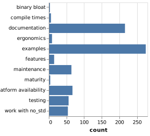

# Rust CLI调查

在2018年3月，我们一直在接受Rust CLI调查的回复。根据社区的意见，这项调查旨在为我们提供一些重点领域[CLI Working Group](https://github.com/rust-lang-nursery/cli-wg)（CLI-WG）。

Rust 2018的目标之一是使Rust中的命令行应用程序尽可能无摩擦（并且有趣！）。我们非常兴奋地说：我们收到了1,045条回复！结果虽然多种多样，却为实际目标描绘了一幅非常清晰的画面。

由于CLI-WG相对较小，遗憾的是我们无法解决本调查中提出的所有问题。但是对于像这样的帖子，我们希望提高对社区共同寻找的内容以及您可以在自己的包装箱和项目中使用的内容的认识。

在进行任何官方评审或作为CLI-WG的一部分时，我们也将使用这些结果来指导我们的解决方案。

在我们深入研究结果之前，让我们首先定义一个CLI，[according to the working group](https://github.com/rust-lang-nursery/cli-wg/issues/4)，以适当限制范围。

> 对于我们的意图和目的，CLI是任何程序
>
> -   在终端发射
> -   接受来自各种源的配置，例如命令行参数，环境变量或配置文件
> -   使用最少/无用户交互即可完成运行
> -   接受来自标准输入，文件或网络的输入
> -   根据指定的配置对某些输入（文件，网络，stdin）执行处理
> -   通过标准输出进行通信（文件，网络，标准{out，err}）
>
> （我们现在特别不想专注于“TUI”应用程序。）

这可能不是一个包罗万象的定义，但它是我们暂时使用的，以限制范围。一些（甚至很多）调查受访者对TUI做了评论（即提供交互式命令行界面的程序，如`vim`要么`top`），所以我们想说我们承认这个差距，并且可能会在未来寻求协助。但是目前我们称这个工作组“超出范围”（范围太大，我们可能永远无法完成任何事情！）。

有了这个，让我们来看看一些回复，以及我们对结果做了些什么。

## 回应

从人口统计数据开始，令人惊讶的是（并且非常感激）大约44％的受访者使用Rust不到一年，或者根本没有使用Rust！这很棒，因为它让我们“新鲜的眼睛”看到很长一段时间Rustaceans可能会因为他们很久以前就已经解决它（或者找到了解决方法）的问题。然而，这些问题不仅损害了采用，而且造成了可以平滑的不必要的摩擦。

同样，大约33％的受访者表示他们从未或当前没有在Rust中编写CLI应用程序。我们使用这些信息来查看任何特定的摩擦点，这些摩擦点可能会阻止那些可能没有花太多时间挖掘板条箱/文档等的人。

### 正在使用的板条箱

在回复中已经写过（或正在编写）Rust应用程序（大约588个回复）的CLI应用程序的人中，我们询问了他们正在使用的当前包装箱。这给了我们一个很好的常用库列表，或者我们可以专注于抛光API和改进整体文档和指南的领域。此列表还显示了一些相当未知的板条箱*吨*潜力。我们不会在这里列出所有的箱子，因为列表很长，但它将极大地帮助CLI-WG确定在哪里集中精力。

词云最终看起来像这样（链接包含更高分辨率的图像）：

### 在哪里改进

然后我们问这些板条箱在哪些方面可以使用最大的改进。响亮的答案（并在整个调查中重复）是更全面的文档、教程和指南/示例。对更好的文档和示例的请求占了回答这个问题的一半以上，分别占45%和57%！

在整个调查过程中，很多时候都有人要求有能力做一件事，而事实上，已经有一个很好的板条箱可以用来装这件事了。当特定的命名板条箱已经存在于所述板条箱中时，在请求特定的命名板条箱的某些特征时，也有许多响应。

这只是在我们的头脑中重新加强了对更好的文档和示例的需求。由于这些回复，我计划重新查看自己板条箱的文档和示例。

cli-wg在我们的存储库中有一个“跟踪问题”列表，用于讨论与工作组相关的解决方案和问题。由于这项调查，我们提出了更多的问题来解决人们提出的担忧。

对于第一部分，我们打开了两个问题：

-   [The "ideal guide" for writing CLI apps in Rust · Issue #6 · rust-lang-nursery/cli-wg · GitHub](https://github.com/rust-lang-nursery/cli-wg/issues/6)）
-   [Improve ecosystem discoverability · Issue #11 · rust-lang-nursery/cli-wg · GitHub](https://github.com/rust-lang-nursery/cli-wg/issues/11)

在贡献或维护板条箱时，示例和文档也将是重点关注的关键领域。

平台可用性排在第二位（约占14%），因此我们决定在讨论和创建任何官方解决方案或来自cli-wg的评论时考虑三大平台（Linux、Windows和MacOS）。

### 现有差距

接下来，我们问在处理cli应用程序时，生态系统中的当前差距是什么，以及被调查者对它们做了什么。结果可以总结为这些项目符号（不一定按顺序排列）：

-   更好的CLI应用程序结构指南/示例
-   （跨平台）配置文件管理
    -   更好的人机工程学，可以合并不同级别的配置（全局、项目、CLI标志）
-   更好的文件路径人机工程学
-   发布/包装指南/示例
    -   更多关于二进制版本的文档/工具
-   干净的readline实现，每个当前产品的问题
-   标准化生成/安装手册页
-   更好的CLI测试
-   终端着色（尤其是窗口）
-   更好的日志记录（或降低当前的复杂性）
-   更好地记录板条箱
-   LIB增加到1.0
-   改进错误处理
-   发现板条箱的能力

原始文字云如下所示（链接包含更高分辨率的图像）：

请注意，cloud这个词包含了现有差距、受访者所做的工作等，但它仍然准确地描述了锈生态系统中发生的事情。*今天*.

为了开始解决其中一些问题，我们打开了以下问题：

-   [Config file management · Issue #7 · rust-lang-nursery/cli-wg · GitHub](https://github.com/rust-lang-nursery/cli-wg/issues/7)
-   [Testing CLI apps · Issue #9 · rust-lang-nursery/cli-wg · GitHub](https://github.com/rust-lang-nursery/cli-wg/issues/9)
-   [Cross-platform file system abstractions · Issue #10 · rust-lang-nursery/cli-wg · GitHub](https://github.com/rust-lang-nursery/cli-wg/issues/10)
-   [Embrace Standardized Color Control · Issue #15 · rust-lang-nursery/cli-wg · GitHub](https://github.com/rust-lang-nursery/cli-wg/issues/15)
-   [Documenting CLIs · Issue #23 · rust-lang-nursery/cli-wg · GitHub](https://github.com/rust-lang-nursery/cli-wg/issues/23)
-   [Error handling in CLI apps · Issue #12 · rust-lang-nursery/cli-wg · GitHub](https://github.com/rust-lang-nursery/cli-wg/issues/12)
-   [Improve ecosystem discoverability · Issue #11 · rust-lang-nursery/cli-wg · GitHub](https://github.com/rust-lang-nursery/cli-wg/issues/11)

这似乎也是一个普通的主题，人们只是想知道，“我应该用什么板条箱？”[至少从]做`X`“有时，有许多目标相似的板条箱似乎在竞争。虽然我不相信铁锈小组希望“祝福”特定的板条箱，因为这使得新来者很难任意“推翻”任何当前广泛使用的板条箱，但我们*可以*更好地使其清晰可见哪些板条箱得到积极维护和广泛使用。这与cli-wg的目标有些正交，因为它与crattes.io团队最近所做的工作交叉，但这仍然是我们想要考虑的事情，并朝着所有的目标努力。

从cli-wg的角度来看，这其中的一个关键部分是关于如何执行任务的更多指南/教程，并且使用经验证的第三方板条箱编写cli s自然会提高对哪些特定板条箱至少已经过“战斗测试”的认识。

## 建造后

我们想知道人们在构建了CLI应用程序之后会做什么。他们的目标是什么平台，他们如何发布，等等。这些反应帮助我们确定哪些领域将是未来的重点。

### 平台目标

首先，我们问人们瞄准哪些平台，结果是这样的：

-   Linux（92%-662 responses）
-   MACOS（53%-365 responses）
-   Windows（40%-278 responses）
-   BSD Variants（12%-85 responses）
-   Embedded（7%-47 responses）

这是一个惊喜，但仍然是一个伟大的信息，因为它显示的只是人们经常瞄准窗口的应用。我只是把窗户当作第二类公民来处理，而在这次调查之后，我的个人目标是改善我的窗户支撑！I'm just as guilty of treating windows as a second class citizen myself，and thus after this survey a personal goal of mine is to

### 平台特异性问题

我们问，是否有任何具体的平台问题（一些我们已经意识到的问题），并再次明确结果！Windows support is clearly lacking in the ecosystem，this includes end color support，path handling，confirmation file handling，etc.here is a summarized list of the reoccurring themes:

-   Windows Support！！
    -   染色
    -   路径
    -   边缘
-   展示平台的特色需要更多的粉笔
-   交叉计算仍然是复杂的
-   `OsStr`/`OsString`
    -   相比不一致`&str`/`String` 
    -   使用人体工程学
    -   一般的混乱
-   如何指定特定于平台的deps吗
-   缺乏良好的信号处理箱

这些t之前一直在积极工作[@BurntSushi's](https://github.com/BurntSushi)优秀的[`termcolor`](https://crates.io/crates/termcolor)箱是专门设计的交叉

协助上面的子弹,我们已经打开了

-   [Embrace Standardized Color Control · Issue #15 · rust-lang-nursery/cli-wg · GitHub](https://github.com/rust-lang-nursery/cli-wg/issues/15)
-   [Improve ecosystem discoverability · Issue #11 · rust-lang-nursery/cli-wg · GitHub](https://github.com/rust-lang-nursery/cli-wg/issues/11)
-   [Ergonomics of Cross Compiling · Issue #25 · rust-lang-nursery/cli-wg · GitHub](https://github.com/rust-lang-nursery/cli-wg/issues/25)
-   [Ergonomics of String handling · Issue #26 · rust-lang-nursery/cli-wg · GitHub](https://github.com/rust-lang-nursery/cli-wg/issues/26)
-   [Cross-platform file system abstractions · Issue #10 · rust-lang-nursery/cli-wg · GitHub](https://github.com/rust-lang-nursery/cli-wg/issues/10)
-   -   [Signal handling · Issue #27 · rust-lang-nursery/cli-wg · GitHub](https://github.com/rust-lang-nursery/cli-wg/issues/27)

### 分布

最后,我们想知道人们如何得到`cargo install`随着普通压缩(或`tar.gz`' ed)二进制文件。

这为我们指出,一个主要的重点区域,因为`cargo install`最初不是设计来处理大规模[this issue comment from me](https://github.com/rust-lang-nursery/cli-wg/issues/8#issuecomment-370565293))。`cargo install`公平地说,我们没有让人们distinguis*绝对*为了容易分发工具用来使用`cargo install`生锈的开发工具。

我们打开地址packa以下问题

-   [Packaging and distributing apps · Issue #8 · rust-lang-nursery/cli-wg · GitHub](https://github.com/rust-lang-nursery/cli-wg/issues/8)
-   [Improving binary distribution through cargo. · Issue #20 · rust-lang-nursery/cli-wg · GitHub](https://github.com/rust-lang-nursery/cli-wg/issues/20)
-   [Support development of well-behaved CLI apps · Issue #21 · rust-lang-nursery/cli-wg · GitHub](https://github.com/rust-lang-nursery/cli-wg/issues/21)

其他更多的卫理公会教徒分布的完整列表

-   板条箱。`cargo install`io /
-   压缩二进制(51% - 257反应)
-   当地人Linux - 135回应休息(27%)
-   家酿(9% - 46的反应)
-   Linux吸附/ flatpak AppImage(6% - 31的反应)
-   码头工人(2% - 10的反应)
-   Windows巧克力色(2% - 9反应)

## 与其他语言相比

人使用生锈,我们要求执行

有趣的是,并不是很多人

我们也询问受访者是否过我们

Python的远远领先。

-   上面的语言是:
-   C / c++ 26%(237回应)
-   14%(128回应)
-   Ruby 13%(116回应)
-   从11%(100回复)

有许多其他的语言,但n

### 我们能学到什么?

在上面的数字,我们还要求什么*更好的*比生锈,我们可以向他们学习。

绝大多数似乎有两个共同的主题

-   快速原型/发展速度(来自
-   更全面的“框架”(来自红宝石,

尽管其中的一些减少在快速原型

的另一个方面开发速度提高

-   更多的例子
-   更多的指导/工具释放
-   编译时间
-   更好的人体工程学字符串处理

解决上面的子弹我们打开:

-   [Ergonomics of String handling · Issue #26 · rust-lang-nursery/cli-wg · GitHub](https://github.com/rust-lang-nursery/cli-wg/issues/26)
-   [Cross-platform file system abstractions · Issue #10 · rust-lang-nursery/cli-wg · GitHub](https://github.com/rust-lang-nursery/cli-wg/issues/10)
-   [Packaging and distributing apps · Issue #8 · rust-lang-nursery/cli-wg · GitHub](https://github.com/rust-lang-nursery/cli-wg/issues/8)
-   [The "ideal guide" for writing CLI apps in Rust · Issue #6 · rust-lang-nursery/cli-wg · GitHub](https://github.com/rust-lang-nursery/cli-wg/issues/6)

其他的子弹是众所周知的,比如编译

*说句题外话,很多respondants说alread生锈*

## 还有别的事吗?

作为一个分开的问题,我们问受访者

-   `const fn` / `constexpr`拜托!
-   `impl Trait`拜托!
-   文章构建步骤`cargo`是必要的
-   需要更多的努力1.0箱
-   需要自动生成手册

正如上面提到的,[`miri` was recently merged into `rustc`](https://github.com/rust-lang/rust/pull/46882)这使得重大进展吗`constfn` / `constexpr`同时,

一些解决上面的问题点是:

-   [Tracker of Issues in Other Crates · Issue #14 · rust-lang-nursery/cli-wg · GitHub](https://github.com/rust-lang-nursery/cli-wg/issues/14)
-   [Documenting CLIs · Issue #23 · rust-lang-nursery/cli-wg · GitHub](https://github.com/rust-lang-nursery/cli-wg/issues/23)(从一代)
-   [Add an install.rs that lets a file perform installation setup, as well as a permanent installation outdir · Issue #2386 · rust-lang/cargo · GitHub](https://github.com/rust-lang/cargo/issues/2386)

# 现在

许多人在调查还要求m

朝着这个目标的一个例子;[`clap`](https://github.com/kbknapp/clap-rs)和[`structopt`](https://github.com/TeXitoi/structopt)将在不久的将来合并`clap`v3版本。`structopt`是一个自定义推导出包装吗`clap`它很清楚形成havi的调查

还有等项目[`ergo`](https://github.com/rust-crates/ergo)(这是各种sub-crates)仍在

向目标:

> 写一个一次性的铁锈应该是一个小脚本

[@killercup (Pascal Hertleif, the CLI-WG lead)](https://github.com/killercup)正在[`quicli`](https://github.com/killercup/quicli)(读作“很快”,是在“快速CLI`ergo`,它仍然是早期,但是非常挑选了!

## 行动呼吁!

调查完成的工作就是两个

现在是时候声音细节以便我们ca

1.  写下你的箱子。
2.  检查文档
3.  考虑Windows作为目标
4.  创建/评论的问题

我精心制作的非常快。

### 写下你的箱子

人们渴望的例子!

如果你已经有b

如果你没有时间写的例子,开放[This Week in Rust](https://this-week-in-rust.org/).

### 有很多调查回答说

如果你已经有了API文档,有别人的助教

再次,打开请求文档评审是一个问题

### 认为窗户是一流的目标

有许多Windows用户,和

至少,请求Windows维护人员,[AppVeyor](https://www.appveyor.com/),可以使一个巨大的要与众不同!

### 创建和/或评论的问题

调查指出,有很多小的我

创建和评论的问题(在你的噢*巨大的*的帮助。

我经常听到短语说话的人的人*确定*他们已经知道`x`!”,或者更糟的是,“我不想为embarras b

请,*请*如果你看到一个问题,或者有问题联系t

## 工作组将会做什么

我们当前的任务可以概括为:

-   帮助改善现有的板条箱。
-   巩固现有的解决方案,创造“最好的公关

第一点是关于现有cra*只使用*相比之下被现有的

我们已经提到过的一些项目,但是[Gitter channel](https://gitter.im/rust-lang/WG-CLI)我们讨论这个!)

# 谢谢你！

这样说,我们要感谢所有的受访者

CLI-WG也有[Gitter channel](https://gitter.im/rust-lang/WG-CLI)开放的人希望贡献。[the CLI-WG repository](https://github.com/rust-lang-nursery/cli-wg)一个

最后一次,谢谢你所有的过去

请继续关注CLI-WG通讯在t和更新
